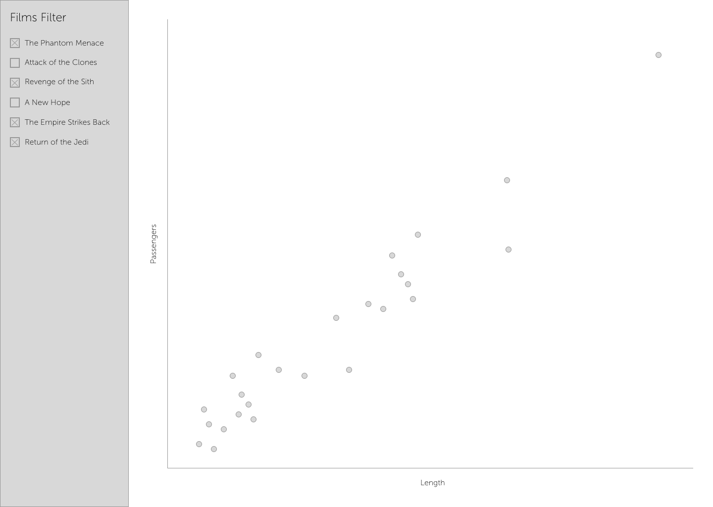

# Star Wars Starship Scatter plot

This project is a simple scatter plot of Star Wars starships. It is built using React and Typescript. It uses the [SWAPI](https://swapi.dev/) to fetch the data.

## Instructions

Use the [SWAPI](https://swapi.dev/) dataset to create a scatter plot of all Star Wars starships. Additionally, the scatter plot should be filterable by the Star Wars film in which the starship appeared.
The scatter plot should be built using D3.js. Please feel free to use any component libraries to help you build the UI.
Be as creative as you would like with the appearance of the scatter plot and the film filter. We are looking for a clean, intuitive UI that is easy to use.
High quality code is the most important thing we are looking for.
The UI looking pretty is a bonus, but not required. We are more interested in seeing how you structure your code and how you solve the problem.
Lastly, including tests is a bonus, but not required.

The following wireframe is provided as a guide, but feel free to deviate from it as you see fit.

### Data

The data to complete this project can be fetched from the following endpoints:
- GET https://swapi.dev/api/films/ | [Docs](https://swapi.dev/documentation#films) | This endpoint returns a list of all Star Wars films.
- GET https://swapi.dev/api/starships/ | [Docs](https://swapi.dev/documentation#starships) | This endpoint returns a list of all Star Wars starships.

### Requirements

The scatter plot should have the following features:
- [ ] The x-axis should be the length value of the starship.
- [ ] The y-axis should be the passenger value of the starship.
- [ ] When hovering over a point, a tooltip should appear with the name of the starship, the length, and the passenger capacity.

The film filter should have the following features:
- [ ] Each movie should be a toggle button or checkbox.
- [ ] When a movie is toggled on, the scatter plot should include all starships that appeared in that movie.
- [ ] When a movie is toggled off, the scatter plot should exclude all starships that appeared in that movie — unless, when a starship appears in multiple movies, it should be included in the scatter plot if any of the movies are toggled on.
- [ ] When no movies are toggled on, the scatter plot should include all starships.
- [ ] When all movies are toggled on, the scatter plot should include all starships.

### Submission

Please submit your code as a GitHub repository. You can either create a new repository or fork this repository and submit a pull request. If you have modified the build process, please update the README.md file with instructions on how to run your code.

## Getting Started with Create React App

This project was bootstrapped with [Create React App](https://github.com/facebook/create-react-app).

### Available Scripts

In the project directory, you can run:

#### `npm start`

Runs the app in the development mode.\
Open [http://localhost:3000](http://localhost:3000) to view it in the browser.

The page will reload if you make edits.\
You will also see any lint errors in the console.

#### `npm test`

Launches the test runner in the interactive watch mode.\
See the section about [running tests](https://facebook.github.io/create-react-app/docs/running-tests) for more information.

#### `npm run build`

Builds the app for production to the `build` folder.\
It correctly bundles React in production mode and optimizes the build for the best performance.

The build is minified and the filenames include the hashes.\
Your app is ready to be deployed!

See the section about [deployment](https://facebook.github.io/create-react-app/docs/deployment) for more information.

#### `npm run eject`

**Note: this is a one-way operation. Once you `eject`, you can’t go back!**

If you aren’t satisfied with the build tool and configuration choices, you can `eject` at any time. This command will remove the single build dependency from your project.

Instead, it will copy all the configuration files and the transitive dependencies (webpack, Babel, ESLint, etc) right into your project so you have full control over them. All of the commands except `eject` will still work, but they will point to the copied scripts so you can tweak them. At this point you’re on your own.

You don’t have to ever use `eject`. The curated feature set is suitable for small and middle deployments, and you shouldn’t feel obligated to use this feature. However we understand that this tool wouldn’t be useful if you couldn’t customize it when you are ready for it.

### Learn More

You can learn more in the [Create React App documentation](https://facebook.github.io/create-react-app/docs/getting-started).

To learn React, check out the [React documentation](https://reactjs.org/).
